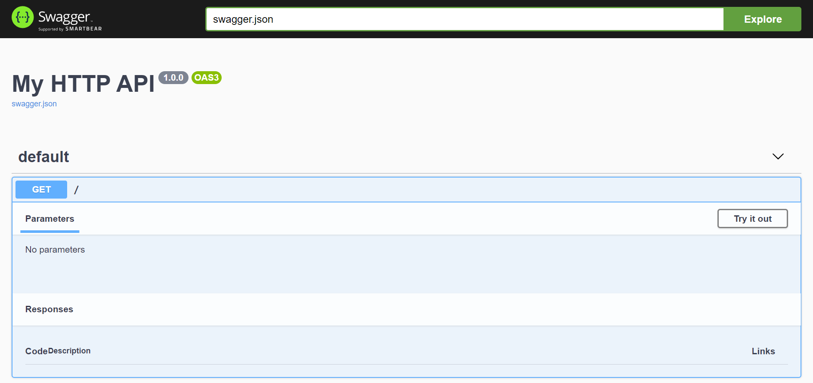

Quickstart
**********

A Minimal Application
=====================

To get started with RestIt we can use the following code snippet:

.. code-block:: python

    from restit import Request, Resource, Response, RestItApp
    from restit.decorator import path

    @path("/")
    class IndexResource(Resource):
        def get(self, request: Request) -> Response:
            return Response("Hello from index.")

    app = RestItApp(resources=[IndexResource()])

    if __name__ == "__main__":
        # start a development server on http://127.0.0.1:5000
        app.start_development_server()

One of the key aspects of *REST* and the *RestIt* library are *Resources*. Since a resource is identified with an
*URI*, in our Python code we assign it using the :func:`~restit.decorator.path` decorator.

Swagger/OpenApi Documentation
=============================

To get your HTTP app serving an *OpenApi* documentation, you have to create an instance of
:class:`~restit.open_api.OpenApiDocumentation` and pass it to your :class:`~restit.RestItApp` constructor.

.. code-block:: python

    open_api_documentation = OpenApiDocumentation(
        info=InfoObject(title="My HTTP API", version="1.0.0"), path="/api"
    )

    app = RestItApp(
        resources=[IndexResource()], open_api_documentation=open_api_documentation
    )

Once you start your development server and navigate to ``http://127.0.0.1:5000/api/`` you will see a minimal *OpenApi*
documentation.

.. note::

    Since we did not yet provide any information about our API we do not see too much in the *OpenApi* documentation yet.

More OpenApi Documentation Details
----------------------------------

Request Details
^^^^^^^^^^^^^^^

A description for the request method is always a good starting point and so we are adding a simple doc string to our
``get`` method:

.. code-block:: python

    @path("/")
    class IndexResource(Resource):
        def get(self, request: Request) -> Response:
            """This is a super get method.

            It takes a request and responds with a text.
            """
            return Response("Hello from index.")

The doc string then will be used to generate the `summary and description <https://swagger.io/specification/#operationObject>`_  fields.

The first line will always be treated as the *summary* and the following lines as the *description*.

.. note::

    The doc string of the resource class will also be recognized and added to the `PathItemObject <https://swagger.io/specification/#pathItemObject>`_,
    but for some reason it might be not appear in the *OpenApi* documentation.

Path Parameters
"""""""""""""""

Imagine you want to add a resource with a parameter in the *URL* - a so called *path parameter*. So for instance, we
want to serve the *URL* ``/users/:id``:

.. code-block:: python

    from marshmallow import fields

    ...

    @path("/users/:id")
    @path_parameter("id", "The user id", fields.Integer())
    class UserResource(Resource):
        def get(self, request: Request) -> Response:
            """Get user information"""
            return Response({"id": request.path_parameters["id"]})

Though our *HTTP* service would also consider the path parameter ``id`` here without the :func:`~restit.decorator.path_parameter`
decorator, we add it because we want to:

1. Hand more information about that parameter to the *OpenApi* documentation
2. Use `marshmallow <https://marshmallow.readthedocs.io/en/stable/>`_ for validation and deserialization here

So in our *OpenApi* documentation we will see the description and the type of our path parameter, but we will also get
the path parameter ``id`` as an *int* in our request method. And we will also get a *400 BadRequest* response status,
if the incoming path parameter can not be deserialized (in our example, because someone is passing a ``id`` of type string).

.. note::

    As an alternative syntax you can also register path parameters the following way:

    .. code-block:: python

            @path("/users/:id", path_parameters=[PathParameter("id", "The user id", fields.Integer())])
            class UserResource(Resource):
                ...

Query Parameters
""""""""""""""""

So now imagine we want to add a query parameter that controls whether to send the address information or not. Lets call
it ``address_info``:

.. code-block:: python

    @path("/users/:id")
    @path_parameter("id", "The user id", fields.Integer())
    class UserResource(Resource):

        @query_parameter("address_info", "Send address information", fields.Boolean(default=False))
        def get(self, request: Request) -> Response:
            """Get user information"""

            if request.query_parameters["address_info"]:
                # collect address information here

            return Response({"name": ...})

An example *URL* can be:

- ``/users/1?address_info=true``
- ``/users/1?address_info=false``
- ``/users/1`` (which here defaults to *false*)

Request Body
""""""""""""

Response Details
^^^^^^^^^^^^^^^^
